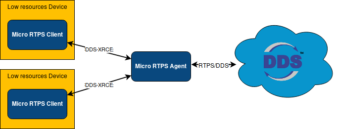
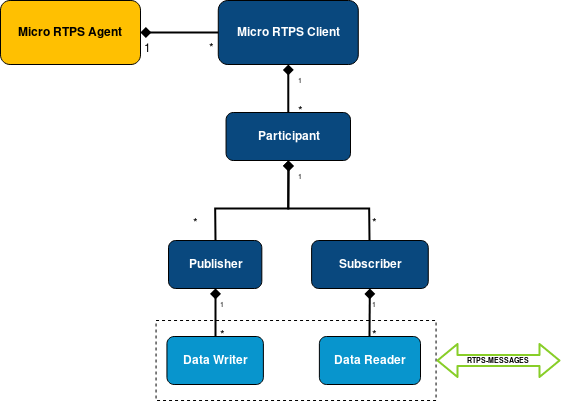

# eProsima Micro RTPS

<a href="http://www.eprosima.com"></a>

*eProsima Micro RTPS* is a software solution which allows to communicate eXtremely Resource Constrained Environments (XRCEs) with an existing DDS network. This implementation complies with the specification proposal, "eXtremely Resource Constrained Environments DDS (DDS-XRCE)" submitted to the Object Management Group (OMG) consortium.

*Micro RTPS* implements a client-server protocol to enable resource-constrained devices (clients) to take part in DDS communications. *Micro RTPS Agent* (server) makes possible this communication. The *Micro RTPS Agent* acts on behalf of the *Micro RTPS Clients* and enables them to take part as DDS publishers and/or subscribers in the DDS Global Data Space.

*Micro RTPS* provides both, a plug and play *Micro RTPS Agent* and an API layer which allows you to implement your *Micro RTPS Clients*.



Quick start
=============

*Micro RTPS* provides a C API which allows you to create your own *Micro RTPS Clients* publishing and/or listening to topics from DDS Global Data Space. The following example is a simple *Micro RTPS Client* (Using that C API) and a *Micro RTPS Agent* publishing a "Hello DDS world!" message to DDS world.

```cpp
    #include <micrortps/client/client.h>
    #include <microcdr/microcdr.h>
    #include <string.h>
    #include <stdlib.h>

    // User type declaration
    typedef struct HelloWorld
    {
        uint32_t index;
        uint32_t message_length;
        char* message;
    } HelloTopic;


    // Serialization implementation provided by the user. Uses Eprosima MicroCDR.
    bool serialize_hello_topic(MicroBuffer* writer, const AbstractTopic* topic_structure)
    {
        HelloTopic* topic = (HelloTopic*) topic_structure->topic;
        serialize_uint32_t(writer, topic->index);
        serialize_array_char(writer, topic->message, topic->message_length);
        return true;
    }

    // User callback for receiving status messages from the Micro RTPS Agent.
    void on_status(XRCEInfo info, uint8_t operation, uint8_t status, void* args)
    {
        // Process status message.
    };

    int main(int args, char** argv)
        {
        // Creates a Client state.
        ClientState* state = new_udp_client_state(4096, "127.0.0.1", 2019, 2020);

        // Creates a Client on the Micro RTPS Micro RTPS Agent.
        create_client(state, on_status, NULL);

        // Creates a Participant on the Micro RTPS Agent.
        XRCEInfo participant_info = create_participant(state);

        // Register a Topic on the given Participant. Uses a Topic configuration written in xml format
        String topic_profile = {"<dds><topic><name>HelloWorldTopic</name><dataType>HelloWorld</dataType></topic></dds>", 86};
        create_topic(state, participant_info.object_id, topic_profile);

        // Creates a publisher on the given Participant
        XRCEInfo publisher_info = create_publisher(state, participant_info.object_id);

        // Creates a data writer using the Participant and publisher recently created. This data writer is configured through a XML profile.
        String data_writer_profile = {"<profiles><publisher profile_name=\"default_xrce_publisher_profile\"><topic><kind>NO_KEY</kind><name>HelloWorldTopic</name><dataType>HelloWorld</dataType><historyQos><kind>KEEP_LAST</kind><depth>5</depth></historyQos><durability><kind>TRANSIENT_LOCAL</kind></durability></topic></publisher></profiles>",
        300+1};
        XRCEInfo data_writer_info = create_data_writer(state, participant_info.object_id, publisher_info.object_id, data_writer_profile);

        // Prepare and write the user data to be sent.
        char message[] = "Hello DDS world!";
        uint32_t length = strlen(message) + 1;
        HelloTopic hello_topic = (HelloTopic){1, length, message};
        // Write user type data.
        write_data(state, data_writer_info.object_id, serialize_hello_topic, &hello_topic);

        // Send the data through the UDP transport.
        send_to_agent(state);

        // Free all the ClientState resources.
        free_client_state(state);
    }
```

For building your Client you need to build against the following libs

    gcc <your_main.c> -lmicrocdr -lmicrortps-client -ltransport

Along with these *Micro RTPS Clients*, you need to have already started a *Micro RTPS Agent* listening on the same UDP ports:

    $ cd /usr/local/bin && micrortps_agent udp 127.0.0.1 2020 2019

and for seeing the messages from the DDS Global Data Space point fo view, you can use *Fast RTPS* HelloWorld example running a subscriber [Fast RTPS HelloWorld](http://eprosima-fast-rtps.readthedocs.io/en/latest/introduction.html#building-your-first-application):

    $ cd /usr/local/examples/C++/HelloWorldExample
    $ sudo make && cd bin
    $ ./HelloWorldExample subscriber

This example shows how a *Micro RTPS Client* publishes messages on a DDS Global Data Space. You need to create different kind of entities on a *Micro RTPS Agent* using Operations requests sent by *Micro RTPS Client*.

The following figure represents the hierarchy of objects you need to instantiate on the *Micro RTPS Agent* to publish on a topic:



Installation from Sources
=========================

Installing Agent and Client
---------------------------

Clone the project from Github:

    $ git clone --recursive https://github.com/eProsima/micro-RTPS.git
    $ mkdir micro-RTPS/build && cd micro-RTPS/build

On Linux, execute:

    $ cmake ..
    $ make
    $ sudo make install

Now you have Micro-RTPS-Agent and Micro-RTPS-Client installed in your system.

Installing the Agent stand-alone
--------------------------------

Clone the project from Github: ::

    $ git clone --recursive https://github.com/eProsima/micro-RTPS-agent.git
    $ mkdir micro-RTPS-agent/build && cd micro-RTPS-agent/build

On Linux, execute: ::

    $ cmake -DTHIRDPARTY=ON ..
    $ make
    $ sudo make install

Now you have micrortps_agent installed in your system. Before running it, you need to add /usr/local/lib to the dynamic loader-linker directories. ::

    sudo ldconfig /usr/local/lib/

Installing the Client stand-alone
---------------------------------

Clone the project from Github: ::

    $ git clone --recursive  https://github.com/eProsima/micro-RTPS-client.git
    $ mkdir micro-RTPS-client/build && cd micro-RTPS-client/build

On Linux, execute: ::

    $ cmake -DTHIRDPARTY=ON ..
    $ make
    $ sudo make install

If you want to install our *Micro RTPS Client* examples you can add "-DEPROSIMA_BUILD_EXAMPLES=ON" to the cmake command line options.

## Documentation

You can access the documentation online, which is hosted on [Read the Docs](http://micro-rtps.readthedocs.io).

* [Start Page](http://micro-rtps.readthedocs.io)
* [Installation manual](http://micro-rtps.readthedocs.io/en/latest/dependencies.html)
* [User manual](http://micro-rtps.readthedocs.io/en/latest/introduction.html)

## Getting Help

If you need support you can reach us by mail at `support@eProsima.com` or by phone at `+34 91 804 34 48`.
