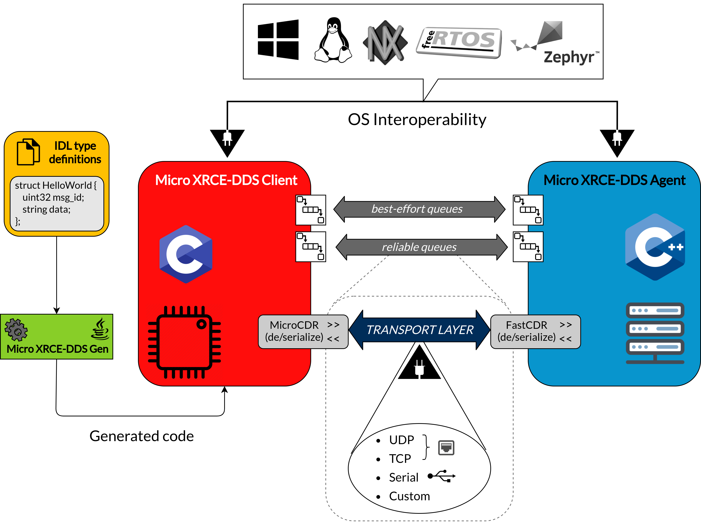

# eProsima Micro XRCE-DDS

*eProsima Micro XRCE-DDS* is a library implementing the [DDS-XRCE protocol](https://www.omg.org/spec/DDS-XRCE/About-DDS-XRCE/) as defined and maintained by the OMG, whose aim is to allow resource constrained devices such as microcontrollers to communicate with the [DDS](https://www.omg.org/spec/DDS/About-DDS/>) world as any other DDS actor would do.
It follows a client/server paradigm and is composed by two libraries, the *Micro XRCE-DDS Client* and the *Micro XRCE-DDS Agent*. The *Micro XRCE-DDS Clients* are lightweight entities meant to be compiled on e**X**tremely **R**esource **C**onstrained **E**nvironments, while the *Micro XRCE-DDS Agent* is a broker which bridges the *Clients* with the DDS world.

  

The *Micro XRCE-DDS Clients* request operations to the *Agent* to publish and/or subscribe to topics in the DDS global dataspace. Remote procedure calls, as defined by the [DDS-RPC standard](https://www.omg.org/spec/DDS-RPC/About-DDS-RPC/), are also supported, allowing *Clients* to communicate in the DDS dataspace according to a request/reply paradigm.
The *Agents* process these requests and send back a response with the operation status result and with the requested data, in the case of subscribe/reply operations.

*eProsima Micro XRCE-DDS* provides the user with a C API to create *Micro XRCE-DDS Clients* applications. The library can be configured at compile-time via a set of CMake flags allowing to enable or disable some profiles before compilation, and to manipulate several parameters controlling some of the library's functionalities, which in turn allow tuning the library size.

The *Micro XRCE-DDS Agent* receives messages containing request operations from the *Clients*, processes these requests and sends back a response with the operation status result and with the requested data, in the case of subscribe/reply operations.

*Agents* keep track of the *Clients* by means of a dedicated `ProxyClient` entity that acts on behalf of the latter.
This is made possible by the creation of *DDS Entities* on the *Agent* as a result of *Clients*' operations, such as *Participants*, *Topics*, *Publishers*, and *Subscribers*, which can interact with the DDS global dataspace.

The communication between a *Micro XRCE-DDS Client* and a *Micro XRCE-DDS Agent* is achieved by means of several kinds of built-in transports: **UDPv4**, **UDPv6**, **TCPv4**, **TCPv6** and **Serial** communication. In addition, there is the possibility for the user to generate its own **Custom** transport.

  

This repository contains the totality of the *eProsima Micro XRCE-DDS* products:

- [*Micro XRCE-DDS Client*](https://github.com/eProsima/Micro-XRCE-DDS-Client)
- [*Micro XRCE-DDS Agent*](https://github.com/eProsima/Micro-XRCE-DDS-Agent)
- [*Micro XRCE-DDS Gen*](https://github.com/eProsima/Micro-XRCE-DDS-Gen)

## Documentation

You can access the *eProsima Micro XRCE-DDS* user documentation online, which is hosted on Read the Docs.

* [Start Page](http://micro-xrce-dds.readthedocs.io)
* [Installation manual](http://micro-xrce-dds.readthedocs.io/en/latest/installation.html)
* [User manual](http://micro-xrce-dds.readthedocs.io/en/latest/introduction.html)

## Getting Help

If you need support you can reach us by mail at `support@eProsima.com` or by phone at `+34 91 804 34 48`.
